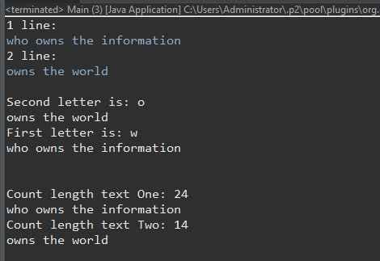

# 3. Утилітарні класи. Обробка масивів і рядків

## Тема
- Розробка власних утилітарних класів.
- Набуття навичок вирішення прикладних задач з використанням масивів і рядків.
## 1. Вимоги
- Розробити та продемонструвати консольну програму мовою Java в середовищі Eclipse для вирішення прикладної задачі за номером, що відповідає збільшеному на одиницю залишку від ділення на 15 зменшеного на одиницю номера студента в журналі групи.
- При вирішенні прикладних задач використовувати латинку.
- Продемонструвати використання об'єктів класу StringBuilder або StringBuffer.
- Застосувати функціональну (процедурну) декомпозицію - розробити власні утилітарні класи (особливий випадок допоміжного класу, див. Helper Class) та для обробки даних використовувати відповідні статичні методи.
- Забороняється використовувати засоби обробки регулярних виразів: класи пакету java.util.regex (Pattern, Matcher та ін.), а також відповідні методи класу String (matches, replace, replaceFirst, replaceAll, split).

### 1.1 Розробник
- Борисов Ілля Володимирович
- КН-921в
- 2 варіант

### 1.2 Загальне завдання
- Скомпілювати проект у терміналі
- Оформити роботу
- Продемонструвати використання об'єктів класу StringBuilder або StringBuffer.
- При вирішенні прикладних задач використовувати латинку.

### 1.3 Задача
- Ввести декілька рядків. Упорядкувати, а потім вивести рядки за алфавітом (перший пріоритет) та в порядку зростання їх довжини (другий пріоритет).

## 2. Опис програми
- Структура программи:
  - Головний клас з точкою входа в програму знаходиться у пакеті: ua.khpi.oop.borusov03.Main
- Компіляція програми у терміналі:
  - 
  
### 2.1 Засоби ООП
- Java code convention
- JDK:
- StringBuilder
  
### 2.2 Ієрархія та структура класів
- Програма має лише один клас
### 2.3 Важливі фрагменти програми:
- Сортировка за алфавітом
~~~java
/**
     * Sorting text
     *
     * @param textOne, textTwo
     * @return Sort text which alphabet
     */
	static void sortAplphabet (String textOne, String textTwo) {		
		String letterOne = Character.toString(textOne.charAt(0));
		String letterTwo = Character.toString(textTwo.charAt(0));

		ArrayList<String> abc = new ArrayList<String>(); 
		abc.add(letterOne); 
		abc.add(letterTwo); 

		Collections.sort(abc); 
		Iterator<String> itr=abc.iterator();  
		
		if (itr.next() == letterOne) {
			System.out.println("First letter is: "+letterOne);
			System.out.println(textOne);
			System.out.println("Second letter is: "+letterTwo);
			System.out.println(textTwo);
		} else {
			System.out.println("Second letter is: "+letterTwo);
			System.out.println(textTwo);
			System.out.println("First letter is: "+letterOne);
			System.out.println(textOne);
		}
		System.out.println("\n");

	}

~~~
- Сортировка за кількістю знаків
~~~java
/**
     * Count letter in sting
     *
     * @param textOne, textTwo
     * @return most biggest text
     */
	static void count (String textOne, String textTwo) {
		
		int lengthOne = textOne.length();
		int lengthTwo = textTwo.length();
	
		if (lengthOne > lengthTwo) {
			System.out.println("Count length text One: " +  textOne.length());
			System.out.println(textOne);
			System.out.println("Count length text Two: " +  textTwo.length());
			System.out.println(textTwo);

		} else {
			System.out.println("Count length text Two: " +  textTwo.length());
			System.out.println(textTwo);
			System.out.println("Count length text One: " +  textOne.length());
			System.out.println(textOne);
		}
			
	}
~~~
## Варіанти використання
Підрахунок бітів для створення найпростішого хешування
## Висновки
На цій лабораторній роботі навчились працювати з StringBuilder